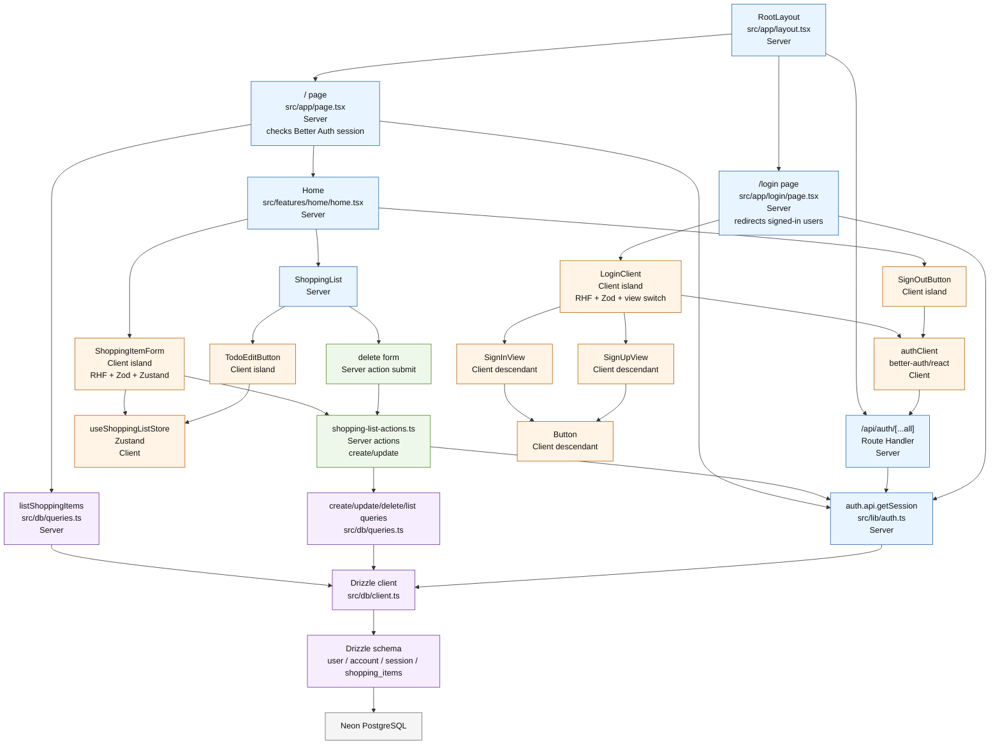

# Component Composition

This diagram shows the current Next.js App Router component composition and marks the React Server Component and Client Component boundaries.

Notes:

- `SignInView`, `SignUpView`, and `Button` do not declare `'use client'`, but they are imported by `LoginClient`, so they belong to that client subtree.
- `ShoppingList` stays server-rendered; `TodoEditButton` is the client island that writes the transient edit selection to Zustand.
- Shopping-list mutations run through server actions, then Drizzle writes to Neon PostgreSQL.
