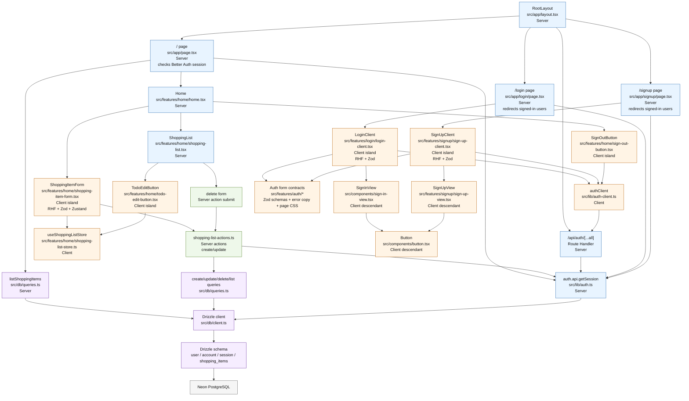

```mermaid
flowchart TD
  %% Current Next.js App Router component composition.
  %% Blue = Server Component / server code, Orange = Client Component, Green = server action, Purple = data layer.

  Root["RootLayout<br/>src/app/layout.tsx<br/>Server"]:::server

  Root --> HomeRoute["/ page<br/>src/app/page.tsx<br/>Server<br/>checks Better Auth session"]:::server
  Root --> LoginRoute["/login page<br/>src/app/login/page.tsx<br/>Server<br/>redirects signed-in users"]:::server
  Root --> SignUpRoute["/signup page<br/>src/app/signup/page.tsx<br/>Server<br/>redirects signed-in users"]:::server
  Root --> AuthRoute["/api/auth/[...all]<br/>Route Handler<br/>Server"]:::server

  HomeRoute --> AuthServer["auth.api.getSession<br/>src/lib/auth.ts<br/>Server"]:::server
  HomeRoute --> ListQuery["listShoppingItems<br/>src/db/queries.ts<br/>Server"]:::data
  HomeRoute --> Home["Home<br/>src/features/home/home.tsx<br/>Server"]:::server

  Home --> SignOutButton["SignOutButton<br/>src/features/home/sign-out-button.tsx<br/>Client island"]:::client
  Home --> ShoppingItemForm["ShoppingItemForm<br/>src/features/home/shopping-item-form.tsx<br/>Client island<br/>RHF + Zod + Zustand"]:::client
  Home --> ShoppingList["ShoppingList<br/>src/features/home/shopping-list.tsx<br/>Server"]:::server

  ShoppingItemForm --> Store["useShoppingListStore<br/>src/features/home/shopping-list-store.ts<br/>Client"]:::client
  ShoppingItemForm --> ItemActions["shopping-list-actions.ts<br/>Server actions<br/>create/update"]:::action

  ShoppingList --> TodoEditButton["TodoEditButton<br/>src/features/home/todo-edit-button.tsx<br/>Client island"]:::client
  ShoppingList --> DeleteForm["delete form<br/>Server action submit"]:::action
  DeleteForm --> ItemActions
  TodoEditButton --> Store

  ItemActions --> AuthServer
  ItemActions --> Queries["create/update/delete/list queries<br/>src/db/queries.ts"]:::data
  ListQuery --> DbClient["Drizzle client<br/>src/db/client.ts"]:::data
  Queries --> DbClient
  AuthServer --> DbClient
  AuthRoute --> AuthServer

  DbClient --> Schema["Drizzle schema<br/>user / account / session / shopping_items"]:::data
  Schema --> Neon["Neon PostgreSQL"]:::external

  LoginRoute --> AuthServer
  LoginRoute --> LoginClient["LoginClient<br/>src/features/login/login-client.tsx<br/>Client island<br/>RHF + Zod"]:::client
  LoginClient --> SignInView["SignInView<br/>src/components/sign-in-view.tsx<br/>Client descendant"]:::client
  LoginClient --> AuthForms["Auth form contracts<br/>src/features/auth/*<br/>Zod schemas + error copy + page CSS"]:::client
  LoginClient --> AuthClient["authClient<br/>src/lib/auth-client.ts<br/>Client"]:::client

  SignUpRoute --> AuthServer
  SignUpRoute --> SignUpClient["SignUpClient<br/>src/features/signup/sign-up-client.tsx<br/>Client island<br/>RHF + Zod"]:::client
  SignUpClient --> SignUpView["SignUpView<br/>src/features/signup/sign-up-view.tsx<br/>Client descendant"]:::client
  SignUpClient --> AuthForms
  SignUpClient --> AuthClient

  SignInView --> Button["Button<br/>src/components/button.tsx<br/>Client descendant"]:::client
  SignUpView --> Button
  SignOutButton --> AuthClient
  AuthClient --> AuthRoute

  classDef server fill:#e8f4ff,stroke:#2166ac,color:#111
  classDef client fill:#fff4e5,stroke:#b45f06,color:#111
  classDef action fill:#eef8ea,stroke:#4f7f22,color:#111
  classDef data fill:#f6edff,stroke:#6a329f,color:#111
  classDef external fill:#f5f5f5,stroke:#666,color:#111
```
