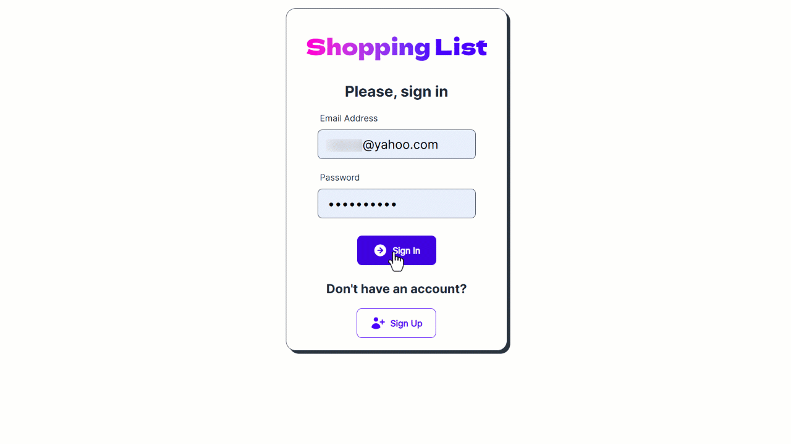

# Shopping List App



## Description

### The app allows you to organize your shopping list in a simple and convenient way

### Features

- Compelling UI & Solid UX
- Major browser compatibility
- Fast Firebase SaaS
- Email & Password Authentication

### Dependencies

- `Vite`
- `React` • `Tailwind`
- `Firebase`

## Installation & Execution

### Install via Vite

```bash
  git clone https://github.com/mirzaianov/shopping-list.git
  cd shopping-list
  npm i
```

### Run in the development mode

```bash
  npm run dev
```

Vite will start frontend server on [http://localhost:5173/](http://localhost:5173/)

### Or open the deployed site

[https://shopping-mirzaianov.vercel.app/](https://shopping-mirzaianov.vercel.app/)

## Building and Running for Production

```bash
  npm run build
  npm run preview
```

Vite will start frontend server on [http://localhost:4173/](http://localhost:4173/)

## License

### MIT license

You can use the code, but I ask you do not copy this site without giving me credit.
