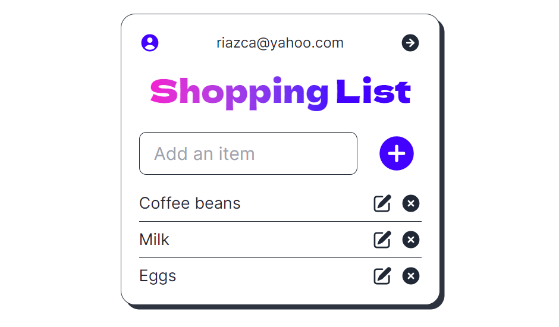

# Shopping List App

## Description

### The app allows you to organize your shopping list in a simple and convenient way

### Features

- Compelling UI & Solid UX
- Major browser compatibility
- Fast Firebase SaaS
- Email & Password Authentication

### Dependencies

- `Vite`
- `React` • `Tailwind`
- `Firebase`

## Installation & Execution

### Install via Vite:

    npm create vite@latest
    cd my-project
    npm install

### Run in the development mode:

    npm run dev

Vite will start frontend server on http://localhost:5173/

## Building and Running for Production

    npm run build
    npm run preview

Vite will start frontend server on http://localhost:4173/

## Licence

### MIT license

You can use the code, but I ask you do not copy this site without giving me credit.

## Version History

- 3.0.0 Release
