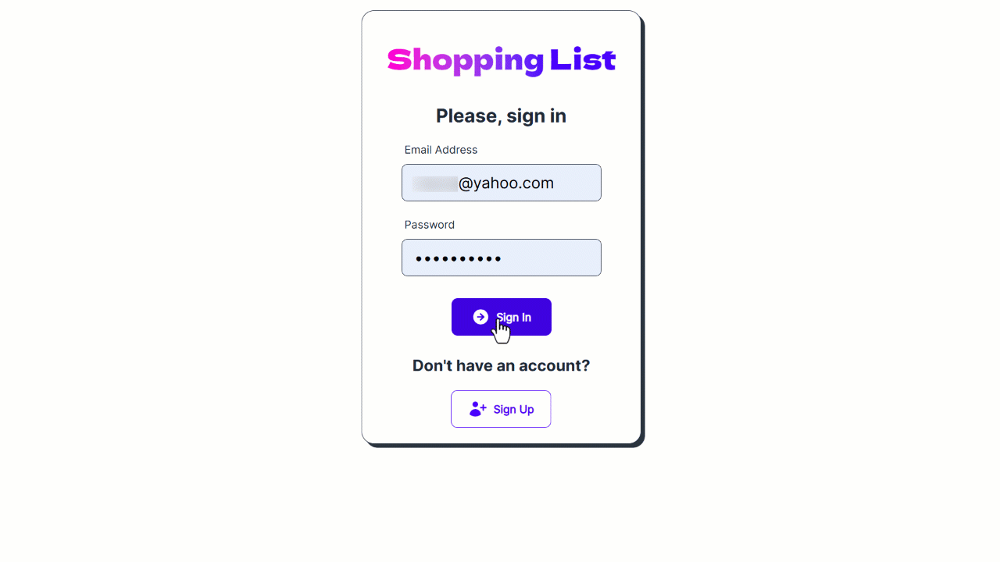

# Shopping List App



## Description

### The app allows you to organize your shopping list in a simple and convenient way

### Features

- Compelling UI & Solid UX
- Major browser compatibility
- Fast Firebase SaaS
- Email & Password Authentication

### Dependencies

- `Vite`
- `React` • `TypeScript`
- `Firebase`
- `CSS Modules`
- `Varlock`

## Installation & Execution

### Install

```bash
  git clone https://github.com/mirzaianov/shopping-list.git
  cd shopping-list
  pnpm install
```

### Configure environment

Add local KeePassXC connection values in `.env.local`:

```env
KP_DB_PATH=C:\path\to\database.kdbx
KP_PASSWORD=<keepass-database-password>
```

Then encrypt the local password:

```bash
  pnpm exec varlock encrypt --file .env.local
```

Firebase, Neon, and Better Auth values are resolved from the `shopping-list/*` KeePass group defined in `.env.schema`.

For the Next.js migration path, also add:

```text
shopping-list/DATABASE_URL
shopping-list/BETTER_AUTH_SECRET
```

### Run in the development mode

```bash
  pnpm dev
```

Vite will start frontend server on [http://localhost:5173/](http://localhost:5173/)

### Or open the deployed site

[https://shopping-mirzaianov.vercel.app/](https://shopping-mirzaianov.vercel.app/)

## Building and Running for Production

```bash
  pnpm build
  pnpm preview
```

Vite will start frontend server on [http://localhost:4173/](http://localhost:4173/)

## License

### MIT license

You can use the code, but I ask you do not copy this site without giving me credit.
